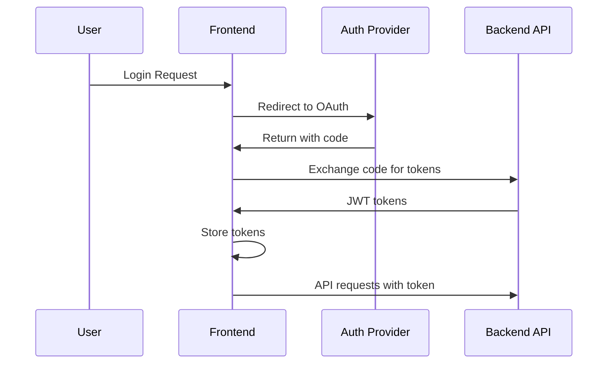

# API Documentation

Personal Hub uses a RESTful API architecture with JWT authentication. This document covers the API integration patterns and available endpoints.

## 🔐 Authentication

Personal Hub uses OpenID Connect (OIDC) with JWT tokens for authentication.

### Authentication Flow



### Token Management

Tokens are stored in localStorage and automatically refreshed:

```typescript
// Automatic token refresh
const token = await authService.getValidToken();
// Returns existing token or refreshes if expired
```

### Request Headers

All authenticated requests include:

```http
Authorization: Bearer <jwt_token>
Content-Type: application/json
```

## 🌐 Base Configuration

### Development
```
http://localhost:8080/api/v1
```

### Production
```
https://api.yourdomain.com/api/v1
```

### API Client Setup

```typescript
// src/lib/api-client.ts
import axios from 'axios';

const apiClient = axios.create({
  baseURL: process.env.NEXT_PUBLIC_API_URL,
  headers: {
    'Content-Type': 'application/json',
  },
});

// Request interceptor for auth
apiClient.interceptors.request.use(async (config) => {
  const token = await authService.getValidToken();
  if (token) {
    config.headers.Authorization = `Bearer ${token}`;
  }
  return config;
});

// Response interceptor for errors
apiClient.interceptors.response.use(
  (response) => response,
  async (error) => {
    if (error.response?.status === 401) {
      await authService.logout();
      window.location.href = '/login';
    }
    return Promise.reject(error);
  }
);
```

## 📊 Common Response Formats

### Success Response

```json
{
  "data": {
    // Response data
  },
  "meta": {
    "timestamp": "2024-06-30T10:00:00Z",
    "version": "1.0"
  }
}
```

### Error Response

```json
{
  "error": {
    "code": "VALIDATION_ERROR",
    "message": "Invalid input data",
    "details": {
      "field": "email",
      "reason": "Invalid email format"
    }
  }
}
```

### Pagination Response

```json
{
  "data": [...],
  "pagination": {
    "page": 1,
    "pageSize": 20,
    "totalItems": 100,
    "totalPages": 5
  }
}
```

## 📝 TODO Endpoints

### List TODOs

```http
GET /todos
```

Query Parameters:
- `status` - Filter by status (pending, in_progress, completed)
- `priority` - Filter by priority (low, medium, high)
- `page` - Page number (default: 1)
- `limit` - Items per page (default: 20)

Response:
```json
{
  "data": [
    {
      "id": "uuid",
      "title": "Complete project",
      "description": "Finish the Personal Hub project",
      "status": "in_progress",
      "priority": "high",
      "dueDate": "2024-07-15T00:00:00Z",
      "createdAt": "2024-06-30T10:00:00Z",
      "updatedAt": "2024-06-30T10:00:00Z"
    }
  ],
  "pagination": {
    "page": 1,
    "pageSize": 20,
    "totalItems": 45,
    "totalPages": 3
  }
}
```

### Create TODO

```http
POST /todos
```

Request Body:
```json
{
  "title": "New task",
  "description": "Task description",
  "priority": "medium",
  "dueDate": "2024-07-15T00:00:00Z"
}
```

Response:
```json
{
  "data": {
    "id": "uuid",
    "title": "New task",
    "status": "pending",
    // ... other fields
  }
}
```

### Update TODO

```http
PUT /todos/:id
```

Request Body:
```json
{
  "title": "Updated title",
  "status": "completed",
  "priority": "high"
}
```

### Delete TODO

```http
DELETE /todos/:id
```

Response:
```json
{
  "message": "TODO deleted successfully"
}
```

## 📅 Calendar Endpoints

### List Events

```http
GET /calendar/events
```

Query Parameters:
- `start` - Start date (ISO 8601)
- `end` - End date (ISO 8601)
- `category` - Filter by category

Response:
```json
{
  "data": [
    {
      "id": "uuid",
      "title": "Team Meeting",
      "description": "Weekly sync",
      "startTime": "2024-07-01T10:00:00Z",
      "endTime": "2024-07-01T11:00:00Z",
      "isAllDay": false,
      "category": "meeting",
      "color": "#3B82F6"
    }
  ]
}
```

### Create Event

```http
POST /calendar/events
```

Request Body:
```json
{
  "title": "New Event",
  "description": "Event description",
  "startTime": "2024-07-01T14:00:00Z",
  "endTime": "2024-07-01T15:00:00Z",
  "isAllDay": false,
  "category": "meeting",
  "color": "#3B82F6"
}
```

### Update Event

```http
PUT /calendar/events/:id
```

### Delete Event

```http
DELETE /calendar/events/:id
```

## 📒 Notes Endpoints

### List Notes

```http
GET /notes
```

Query Parameters:
- `category` - Filter by category
- `tags` - Comma-separated tags
- `search` - Search in title and content
- `pinned` - Filter pinned notes (true/false)

Response:
```json
{
  "data": [
    {
      "id": "uuid",
      "title": "Meeting Notes",
      "content": "## Agenda\n- Item 1\n- Item 2",
      "category": "work",
      "tags": ["meeting", "important"],
      "isPinned": true,
      "createdAt": "2024-06-30T10:00:00Z",
      "updatedAt": "2024-06-30T10:00:00Z"
    }
  ]
}
```

### Create Note

```http
POST /notes
```

Request Body:
```json
{
  "title": "New Note",
  "content": "Note content in markdown",
  "category": "personal",
  "tags": ["ideas", "project"]
}
```

### Update Note

```http
PUT /notes/:id
```

### Delete Note

```http
DELETE /notes/:id
```

### Toggle Pin

```http
POST /notes/:id/pin
```

## 🎯 Goals Endpoints

### List Goals

```http
GET /goals
```

Query Parameters:
- `status` - Filter by status (active, completed, archived)
- `targetDate` - Filter by target date

### Create Goal

```http
POST /goals
```

Request Body:
```json
{
  "title": "Learn TypeScript",
  "description": "Complete TypeScript course",
  "targetDate": "2024-12-31T00:00:00Z",
  "category": "learning"
}
```

### Track Achievement

```http
POST /goals/:id/achievements
```

Request Body:
```json
{
  "date": "2024-06-30T00:00:00Z",
  "achieved": true
}
```

## 👤 User Endpoints

### Get Profile

```http
GET /users/profile
```

Response:
```json
{
  "data": {
    "id": "uuid",
    "email": "user@example.com",
    "name": "John Doe",
    "avatar": "https://example.com/avatar.jpg",
    "preferences": {
      "theme": "dark",
      "language": "en"
    }
  }
}
```

### Update Profile

```http
PUT /users/profile
```

Request Body:
```json
{
  "name": "John Doe",
  "preferences": {
    "theme": "light",
    "language": "ja"
  }
}
```

## 📊 Analytics Endpoints

### Get Dashboard Stats

```http
GET /analytics/dashboard
```

Response:
```json
{
  "data": {
    "todos": {
      "total": 45,
      "completed": 30,
      "pending": 10,
      "inProgress": 5
    },
    "events": {
      "today": 3,
      "thisWeek": 15,
      "thisMonth": 60
    },
    "notes": {
      "total": 120,
      "pinned": 5
    },
    "productivity": {
      "completionRate": 0.67,
      "streak": 5
    }
  }
}
```

### Get Activity Timeline

```http
GET /analytics/activity
```

Query Parameters:
- `start` - Start date
- `end` - End date
- `type` - Activity type filter

## 🔄 WebSocket Events (Future)

For real-time updates:

```typescript
// Connection
ws://localhost:8080/ws

// Events
{
  "type": "todo.updated",
  "data": {
    "id": "uuid",
    "changes": {...}
  }
}
```

## 🚦 Rate Limiting

API endpoints are rate-limited:

- **Authenticated requests**: 1000 requests/hour
- **Unauthenticated requests**: 100 requests/hour

Rate limit headers:
```http
X-RateLimit-Limit: 1000
X-RateLimit-Remaining: 999
X-RateLimit-Reset: 1625070000
```

## 🛡️ Error Codes

| Code | Description |
|------|-------------|
| `UNAUTHORIZED` | Invalid or missing authentication |
| `FORBIDDEN` | Insufficient permissions |
| `NOT_FOUND` | Resource not found |
| `VALIDATION_ERROR` | Invalid request data |
| `RATE_LIMITED` | Too many requests |
| `SERVER_ERROR` | Internal server error |

## 🧪 Testing API Calls

### Using cURL

```bash
# Get todos
curl -H "Authorization: Bearer <token>" \
  https://api.yourdomain.com/api/v1/todos

# Create todo
curl -X POST \
  -H "Authorization: Bearer <token>" \
  -H "Content-Type: application/json" \
  -d '{"title":"New Task"}' \
  https://api.yourdomain.com/api/v1/todos
```

### Using HTTPie

```bash
# Get todos
http GET api.yourdomain.com/api/v1/todos \
  Authorization:"Bearer <token>"

# Create todo
http POST api.yourdomain.com/api/v1/todos \
  Authorization:"Bearer <token>" \
  title="New Task"
```

## 📚 SDK Usage

### React Hook Examples

```typescript
// List todos
const { data: todos, isLoading } = useTodos({ status: 'pending' });

// Create todo
const createTodo = useCreateTodo();
await createTodo.mutateAsync({
  title: 'New Task',
  priority: 'high'
});

// Update todo
const updateTodo = useUpdateTodo();
await updateTodo.mutateAsync({
  id: 'uuid',
  status: 'completed'
});
```

### Service Layer Examples

```typescript
// Direct service calls
const todos = await todoService.getList({ status: 'pending' });
const newTodo = await todoService.create({ title: 'New Task' });
await todoService.update('uuid', { status: 'completed' });
await todoService.delete('uuid');
```